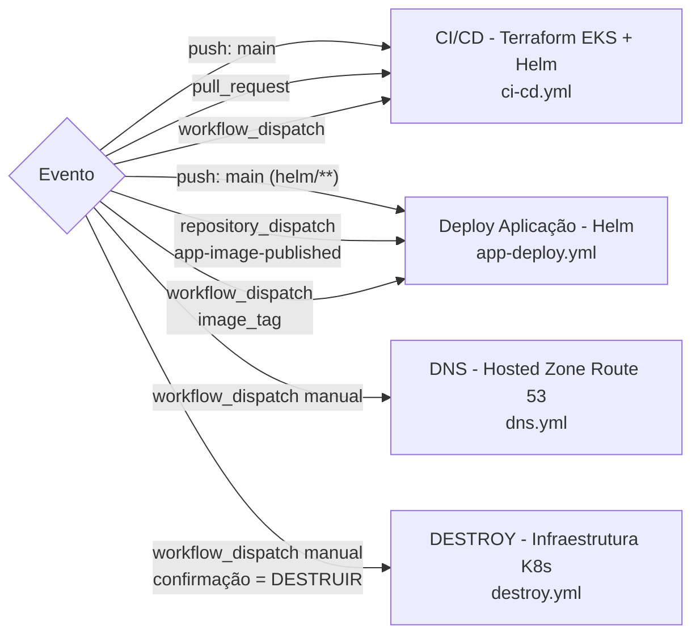
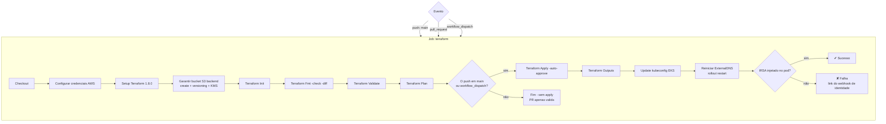
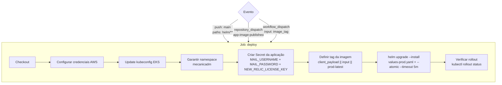
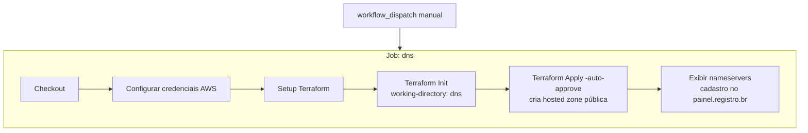
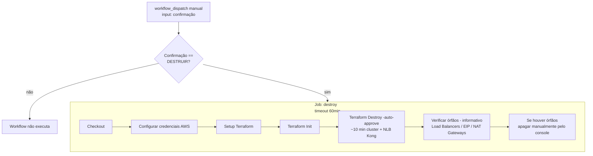

# Mecânica DM - Infraestrutura Kubernetes (Terraform + Helm)


Repositório de infraestrutura que provisiona e gerencia o cluster **Amazon EKS** e todos os add-ons necessários para rodar a API **Mecânica DM** em produção — incluindo API Gateway (Kong), autoscaling (HPA), secrets management (External Secrets Operator), DNS (Route 53 + ExternalDNS) e observabilidade (New Relic).

Na **Fase 03** do 15SOAT, este repositório abriga toda a camada de infraestrutura como código (IaC), separado do código da aplicação (`mecanicadm-api-v3`), da Lambda de validação de CPF (`mecanicadm-lambda-v3`) e do banco de dados (`db-v3`).

---

## 📚 Documentação

### Componenetes de infraestrutura


---

## 🏁 Como Começar

### Pré-requisitos

- [AWS CLI](https://docs.aws.amazon.com/cli/latest/userguide/getting-started-install.html) configurado com credenciais de acesso
- [Terraform](https://developer.hashicorp.com/terraform/install) >= 1.8.0
- [kubectl](https://kubernetes.io/pt-br/docs/tasks/tools/)
- [Helm](https://helm.sh/docs/intro/install/) >= 3.x

### 1. Configurar as Variáveis do GitHub Actions

No repositório GitHub, configure os seguintes **Secrets**:

| Secret | Descrição |
|--------|-----------|
| `AWS_ACCESS_KEY_ID` | Chave de acesso AWS (IAM com permissões EKS, S3, SSM, Route 53, Lambda) |
| `AWS_SECRET_ACCESS_KEY` | Chave secreta AWS |
| `NEW_RELIC_LICENSE_KEY` | License key da New Relic |
| `MAIL_USERNAME` | Usuário SMTP (Gmail) |
| `MAIL_PASSWORD` | Senha SMTP (App Password do Gmail) |
| `DOCKER_IMAGE` | Imagem Docker da API (ex.: `diegopriess/mecanica-dm`) |

E as seguintes **Variables**:

| Variable | Descrição | Padrão |
|----------|-----------|--------|
| `AWS_REGION` | Região AWS | `us-east-1` |
| `TF_STATE_BUCKET` | Nome do bucket S3 para o state | — |
| `EKS_CLUSTER_NAME` | Nome do cluster EKS | `mecanicadm-prod` |

### 2. Criar a Hosted Zone DNS (primeira vez)

Execute o workflow **DNS - Hosted Zone Route 53** via GitHub Actions (manual). Após a criação, copie os nameservers exibidos e cadastre-os no painel do [Registro.br](https://registro.br) para o domínio `mecanicadm.com.br`.

### 3. Provisionar a Infraestrutura

Execute o workflow **CI/CD - Terraform EKS + Helm** (push na main ou manual). Ele irá:

1. Criar o bucket S3 para o state (se não existir)
2. Executar `terraform init`, `fmt`, `validate`, `plan` e `apply`
3. Atualizar o kubeconfig do EKS
4. Reiniciar o ExternalDNS e verificar a injeção do IRSA

### 4. Deploy da Aplicação

O workflow **Deploy Aplicação - Helm** é disparado automaticamente quando:
- Arquivos em `helm/**` são alterados na main
- O repo `mecanicadm-api-v3` publica uma nova imagem (`repository_dispatch`)
- Executado manualmente (com tag de imagem opcional)

---

## 🔧 Comandos Úteis

### Verificar os recursos do cluster

```bash
kubectl get all -n mecanicadm
kubectl get all -n kong
```

### Verificar o status do HPA

```bash
kubectl get hpa -n mecanicadm
```

### Verificar os External Secrets

```bash
kubectl get externalsecrets -n mecanicadm
kubectl get secrets -n mecanicadm
```

### Verificar o ExternalDNS

```bash
kubectl get pods -n external-dns
kubectl logs -n external-dns -l app.kubernetes.io/name=external-dns --tail=50
```

### Verificar o Kong

```bash
kubectl get ingress -n mecanicadm
kubectl get svc -n kong
```

### Logs da aplicação

```bash
kubectl logs -n mecanicadm -l app.kubernetes.io/name=mecanicadm --tail=100 -f
```

---

## ⚠️ Destruir a Infraestrutura

Execute o workflow **DESTROY** via GitHub Actions (manual). É necessário digitar **"DESTRUIR"** no campo de confirmação. O workflow irá:

1. Executar `terraform destroy -auto-approve`
2. Verificar recursos órfãos (Load Balancers, IPs Elásticos, NAT Gateways)

> **Atenção**: A zona DNS (`dns/`) possui state separado e **não** é destruída junto com a infraestrutura principal.

---

## Pipes

Visão geral das 4 pipelines (`.github/workflows/`):



### CI/CD - Terraform EKS + Helm (`ci-cd.yml`)

Disparado por push na `main`, pull request ou manualmente. Valida e aplica a infraestrutura Terraform, e depois de aplicada, prepara o ambiente para o deploy.



### Deploy Aplicação - Helm (`app-deploy.yml`)

Disparado por push na `main` (alterações em `helm/**`), por `repository_dispatch` do repo da API (`app-image-published`) ou manualmente. Instala/atualiza a aplicação no cluster via Helm.



### DNS - Hosted Zone Route 53 (`dns.yml`)

Disparado manualmente. Executa o módulo Terraform `dns/` (state separado) para criar a hosted zone pública e exibir os nameservers para delegação no Registro.br.



### DESTROY - Infraestrutura K8s (`destroy.yml`)

Botão vermelho: disparado apenas manualmente e apenas com a confirmação exata **DESTRUIR**. Executa o `terraform destroy` e verifica recursos órfãos. Timeout de 60 minutos.



